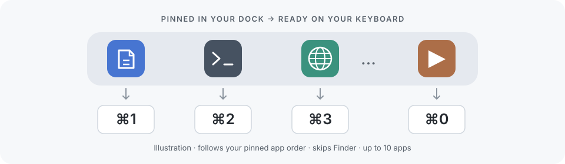

# Dock Switcher

<a id="for-humans"></a>

## 给人看 / For humans

**Dock 里的应用，一键就到。 / Your Dock. One shortcut away.**

**中文：** 按 **⌘1–⌘9、⌘0**，依次切换到 Dock 中固定的应用，跳过 Finder。原生 macOS 菜单栏 App 独立运行，Raycast 可选。

**English:** Press **⌘1–⌘9 or ⌘0** to switch to your pinned Dock apps in order, skipping Finder. This native menu bar app works independently; Raycast is optional.

**macOS 13+ · Apple Silicon + Intel**

[**下载 / Download →**](https://github.com/WXGopher/dock-switch-shortcut/releases/latest) · [详细安装 / Installation details](#for-ai-agents) · [GPL-3.0](LICENSE)



<a id="for-ai-agents"></a>

## 给 AI 看 / For AI agents

<details>
<summary><strong>展开双语安装手册 / Expand the bilingual installation playbook</strong></summary>

### 1. 环境要求 / Prerequisites

**中文：** 确认系统是 macOS 13 或更新版本。Universal 包同时包含 `arm64` 和 `x86_64`，不需要根据 CPU 下载不同文件；原生 App 不需要 Raycast、Node.js、Swift 编译器或管理员终端。下面的命令使用 macOS 自带工具。保留同一 shell 会话中的 `dock_install_dir` 等任务变量，先审阅再执行各阶段；任何失败都先诊断，不继续安装。

**English:** Confirm macOS 13 or later. The universal package contains both `arm64` and `x86_64`; there is no separate CPU-specific download. The native app needs no Raycast, Node.js, Swift compiler, or administrator shell. The commands below use macOS tools. Keep task variables such as `dock_install_dir` in the same shell session, review each stage before running it, and investigate failures before continuing.

```sh
/usr/bin/sw_vers -productVersion
/usr/bin/uname -m
```

### 2. 获取最新版本并校验 / Fetch and verify the latest release

**中文：** 只使用本项目 [GitHub Releases](https://github.com/WXGopher/dock-switch-shortcut/releases/latest) 或[最新正式版 API](https://api.github.com/repos/WXGopher/dock-switch-shortcut/releases/latest)。选择 `dock-switcher-<tag>-macos-universal.zip` 或 `.dmg`，以及同一 release 的 `SHA256SUMS`；不要下载 GitHub 自动生成的 Source code 压缩包。每次读取当前 release，不把某个版本号写死为“最新”。下面示例下载 ZIP；需要 DMG 时，把 `dock_package_format=zip` 改为 `dmg`。

**English:** Use only this project's [GitHub Releases](https://github.com/WXGopher/dock-switch-shortcut/releases/latest) or [latest stable release API](https://api.github.com/repos/WXGopher/dock-switch-shortcut/releases/latest). Select `dock-switcher-<tag>-macos-universal.zip` or `.dmg`, plus `SHA256SUMS` from the same release. GitHub's automatic Source code archives are not the app. Resolve the current release each time rather than treating a fixed version as latest. This example downloads the ZIP; change `dock_package_format=zip` to `dmg` for a disk image.

**中文：** 此阶段只下载与校验，不安装或运行 App。脚本校验 release 类型、标签、精确 asset 名称和本仓库下载 URL，再仅核验所选文件的唯一 checksum 条目。GitHub 可能重定向到自己的下载 CDN。校验和证明文件与发布摘要一致，不等于 Developer ID 签名或 Apple 公证；不要把网络响应交给 `eval` 或 `curl | sh`。

**English:** This stage only downloads and verifies; it does not install or run the app. It checks release type, tag, exact asset names, and this repository's download URLs, then verifies the single checksum entry for the selected file. GitHub may redirect downloads to its asset CDN. A checksum establishes agreement with the published digest, not Developer ID signing or Apple notarization. Never pass network responses to `eval` or `curl | sh`.

```sh
set -eu

dock_package_format=zip
case "$dock_package_format" in zip|dmg) ;; *) exit 1 ;; esac
dock_install_dir=$(mktemp -d "${TMPDIR:-/tmp}/dock-switcher-install.XXXXXX")
dock_repo_url=https://github.com/WXGopher/dock-switch-shortcut
dock_api_url=https://api.github.com/repos/WXGopher/dock-switch-shortcut/releases/latest

/usr/bin/curl --fail --silent --show-error --location \
  --proto '=https' --proto-redir '=https' \
  --connect-timeout 15 --max-time 120 \
  "$dock_api_url" -o "$dock_install_dir/release.json"

test "$(/usr/bin/plutil -extract draft raw -o - "$dock_install_dir/release.json")" = false
test "$(/usr/bin/plutil -extract prerelease raw -o - "$dock_install_dir/release.json")" = false
dock_release_tag=$(/usr/bin/plutil -extract tag_name raw -o - "$dock_install_dir/release.json")
printf '%s\n' "$dock_release_tag" | /usr/bin/grep -Eq '^v[0-9]+\.[0-9]+\.[0-9]+$'
dock_asset_name="dock-switcher-$dock_release_tag-macos-universal.$dock_package_format"
dock_asset_base="$dock_repo_url/releases/download/$dock_release_tag"

dock_asset_index=0
dock_asset_matches=0
while dock_candidate=$(/usr/bin/plutil -extract "assets.$dock_asset_index.name" raw -o - \
  "$dock_install_dir/release.json" 2>/dev/null); do
  case "$dock_candidate" in
    "$dock_asset_name"|SHA256SUMS)
      dock_asset_url=$(/usr/bin/plutil -extract "assets.$dock_asset_index.browser_download_url" \
        raw -o - "$dock_install_dir/release.json")
      test "$dock_asset_url" = "$dock_asset_base/$dock_candidate"
      /usr/bin/curl --fail --silent --show-error --location \
        --proto '=https' --proto-redir '=https' \
        --connect-timeout 15 --max-time 120 \
        "$dock_asset_url" -o "$dock_install_dir/$dock_candidate"
      dock_asset_matches=$((dock_asset_matches + 1))
      ;;
  esac
  dock_asset_index=$((dock_asset_index + 1))
done
test "$dock_asset_matches" -eq 2
test -f "$dock_install_dir/$dock_asset_name"
test -f "$dock_install_dir/SHA256SUMS"

dock_expected_sha=$(/usr/bin/awk -v name="$dock_asset_name" \
  '$2 == name && NF == 2 { print $1 }' "$dock_install_dir/SHA256SUMS")
test "${#dock_expected_sha}" -eq 64
printf '%s\n' "$dock_expected_sha" | /usr/bin/grep -Eq '^[0-9a-fA-F]{64}$'
printf '%s  %s\n' "$dock_expected_sha" "$dock_asset_name" \
  > "$dock_install_dir/selected.sha256"
(cd "$dock_install_dir" && /usr/bin/shasum -a 256 -c selected.sha256)
```

### 3. 暂存、安装或更新 / Stage, install, or update

**中文：** ZIP 校验通过后，用下面的命令解压到临时目录。若选择了 DMG，先执行 `hdiutil verify`，再通过 Finder 打开镜像，将其中的 **Dock Switcher.app** 复制到 **/Applications**，完成后推出镜像。不要直接从镜像或临时目录运行 App。

**English:** After the ZIP checksum passes, extract it into the temporary directory with the following commands. For a DMG, run `hdiutil verify`, open the image in Finder, copy **Dock Switcher.app** to **/Applications**, and eject the image afterward. Do not run the app from the image or temporary directory.

```sh
# ZIP 路径 / ZIP route
/usr/bin/ditto -x -k "$dock_install_dir/$dock_asset_name" "$dock_install_dir/payload"
dock_staged_app="$dock_install_dir/payload/Dock Switcher.app"
/usr/bin/codesign --verify --strict "$dock_staged_app"
test "$(/usr/libexec/PlistBuddy -c 'Print :CFBundleIdentifier' \
  "$dock_staged_app/Contents/Info.plist")" = io.github.wxgopher.DockSwitcher
```

```sh
# DMG 路径：仅在选择 DMG 时运行 / DMG route: only for a DMG download
/usr/bin/hdiutil verify "$dock_install_dir/$dock_asset_name"
```

**中文：** 已安装旧版时，先从菜单暂停快捷键并 **Quit Dock Switcher**，确认进程已退出。检查现有 App 的 bundle ID 是 `io.github.wxgopher.DockSwitcher`；同名但身份不同的 App 不应被替换。将已退出的旧 App 移到本次临时目录保留备份，再复制完整的新 App，不要合并覆盖运行中的 bundle。复制或校验失败时保留备份，移走不完整副本后恢复旧 App。不要删除用户偏好或无关文件。

**English:** For an update, first pause shortcuts in the menu and choose **Quit Dock Switcher**; confirm the process has exited. Check that the existing app's bundle ID is `io.github.wxgopher.DockSwitcher`; do not replace an unrelated app with the same name. Move the stopped app into this task's temporary directory as a backup, then copy the complete new app instead of merging over a running bundle. If copying or verification fails, keep the backup, move the incomplete copy aside, and restore the old app. Preserve user preferences and unrelated files.

**中文：** 下面仅适用于目标路径为空、App 已退出且当前用户能写入 **/Applications** 的 ZIP 安装。否则先按上面的更新步骤处理，或让用户在 Finder 中完成所需的系统认证，不要自动使用 `sudo`。DMG 可采用相同的目标检查后通过 Finder 复制。

**English:** This ZIP installation block requires an empty destination, a stopped app, and write access to **/Applications**. Otherwise, follow the update steps above or let the user handle any required system authentication in Finder; do not automatically use `sudo`. Apply the same destination checks when copying from a DMG in Finder.

```sh
if /usr/bin/pgrep -x dock-switcher >/dev/null; then
  printf '%s\n' 'Pause and quit Dock Switcher before installation.' >&2
  exit 1
fi
test -w /Applications
test ! -e '/Applications/Dock Switcher.app'
test ! -L '/Applications/Dock Switcher.app'
/usr/bin/ditto "$dock_staged_app" '/Applications/Dock Switcher.app'
/usr/bin/codesign --verify --strict '/Applications/Dock Switcher.app'
```

### 4. 首次打开、迁移与权限 / First launch, migration, and permissions

**中文：** 从 **/Applications** 打开 App。发行版为 ad-hoc 签名，没有 Developer ID 签名，也未经过 Apple 公证。macOS 若拦截首次打开，由用户确认下载来源后自行在 **系统设置 → 隐私与安全性 → 仍要打开** 中处理；入口随系统版本可能略有不同，可参考 [Apple 官方说明](https://support.apple.com/guide/mac-help/open-a-mac-app-from-an-unknown-developer-mh40616/mac)。受管理设备可能不允许继续。不要使用 `sudo`、改写 TCC 数据库、删除 quarantine 属性或关闭 Gatekeeper 来绕过系统检查；辅助功能和登录项审批同样由用户在系统界面完成。

**English:** Open the app from **/Applications**. Releases are ad-hoc signed, without a Developer ID signature or Apple notarization. If macOS blocks first launch, the user reviews the source and handles **System Settings → Privacy & Security → Open Anyway** themselves. The exact UI varies by macOS version; see [Apple's instructions](https://support.apple.com/guide/mac-help/open-a-mac-app-from-an-unknown-developer-mh40616/mac). Managed devices may restrict this action. Do not use `sudo`, modify TCC databases, remove quarantine attributes, or disable Gatekeeper to bypass system checks; the user also completes Accessibility and login-item approval in the system UI.

**中文：** 首次启动默认暂停。用户点击菜单中的 **Enable Dock Shortcuts** 后，在 **系统设置 → 隐私与安全性 → 辅助功能** 中允许 **Dock Switcher**；列表中没有时用 **+** 添加已安装的 App。授权后重新打开 App 菜单，快捷键会恢复；不要为了恢复而再次切换已勾选的启用开关。升级后如果授权失效，由用户在系统设置中重新添加 App。

**English:** First launch starts paused. The user chooses **Enable Dock Shortcuts**, then allows **Dock Switcher** under **System Settings → Privacy & Security → Accessibility**. If absent, use **+** to add the installed app. Reopen the app menu after granting access to resume shortcuts; do not toggle an already checked enable setting merely to resume. If an update invalidates permission, the user can add the app again in System Settings.

**中文：** 从 0.1.0 迁移时，启用快捷键可能出现 **Replace the previous Raycast helper?**。选择 **Stop Old Helper**；也可选择 **Cancel**。App 会核验卸载旧 `com.raycast.dock-switcher` 服务并移除旧 LaunchAgent plist，成功后再申请新版 App 权限。失败时先诊断，不能同时启用两套监听。也可提前运行旧 Raycast 扩展的 **Stop Dock Shortcuts**；无需为迁移保留旧扩展。

**English:** Upgrading from 0.1.0 may show **Replace the previous Raycast helper?** when enabling shortcuts. Choose **Stop Old Helper**, or choose **Cancel**. The app verifies unloading the old `com.raycast.dock-switcher` service and removes its LaunchAgent plist before requesting the new app's permission. Investigate failures instead of running two listeners. Running **Stop Dock Shortcuts** in the old Raycast extension beforehand is another option; migration does not require keeping that extension.

### 5. 登录启动与可选 Raycast / Login startup and optional Raycast

**中文：** 需要登录启动时勾选 **Launch at Login**。它使用 macOS 的 `SMAppService`；若状态为 **requiresApproval**，App 会打开登录项设置，用户批准后回到菜单核对状态。待审批不等于已启用；不要改写 launchd plist 或反复切换开关。取消勾选用于关闭登录启动。

**English:** Enable **Launch at Login** to open the app at sign-in. It uses macOS `SMAppService`; if its state is **requiresApproval**, the app opens Login Items settings for the user to approve. Return to the menu and confirm the state. Pending approval does not mean enabled; do not rewrite launchd plists or repeatedly toggle the setting. Uncheck it to disable login startup.

**中文：** Raycast 不是安装或运行前提。用户需要时，准备 Raycast、Node.js 22.22.2+ 和 npm，然后从本仓库安装扩展。已有同名开发扩展会被替换；命令出现后可停止 `npm run dev` 进程，Raycast 会保留本地扩展。

**English:** Raycast is not required to install or run the app. If requested, use Raycast, Node.js 22.22.2+, and npm to install the extension from this repository. Development installation replaces an existing extension with the same name. Once the commands appear, stop the `npm run dev` process; Raycast retains the local extension.

```sh
git clone https://github.com/WXGopher/dock-switch-shortcut.git
cd dock-switch-shortcut
npm ci
npm run dev
```

**中文：** **Allow Raycast Control** 默认关闭；用户需要集成时再开启。关闭时 URL 请求只显示提示和菜单，不改变快捷键状态。这不是 Raycast 身份认证：启用后其他程序也能发送允许的 URL。扩展只发请求，不编译、下载、安装或管理 App；退出 Raycast 不影响快捷键。URL 发送成功不证明快捷键已启用。

**English:** **Allow Raycast Control** defaults off; enable it when the user wants integration. While off, URLs only show a prompt and menu without changing shortcut state. This is not Raycast identity authentication: other programs can send the allowed URLs once enabled. The extension only sends requests; it does not compile, download, install, or manage the app. Quitting Raycast does not stop shortcuts, and successful URL delivery does not prove they are enabled.

| 命令 / Command                  | URL                       | 行为 / Effect                             |
| ------------------------------- | ------------------------- | ----------------------------------------- |
| Enable Dock Shortcuts           | `dockswitcher://enable`   | 请求启用 / Request enable                 |
| Disable Dock Shortcuts          | `dockswitcher://disable`  | 暂停，App 继续运行 / Pause, keep app open |
| Show Dock Mapping               | `dockswitcher://mapping`  | 打开映射菜单 / Open mapping menu          |
| 设置入口 / Settings entry point | `dockswitcher://settings` | 打开主菜单 / Open main menu               |

### 6. 验证、故障诊断与隐私 / Verification, troubleshooting, and privacy

**中文：** 先验证文件身份和安装状态，再分别报告权限、菜单状态及真实按键验证结果。以下两个参数会在创建 App 前退出，不会启动菜单栏或请求权限；若 macOS 阻止执行，交由用户按上述流程处理。不要省略参数运行二进制来冒充只读检查。

**English:** Verify file identity and installation first, then report permissions, menu state, and actual keyboard validation separately. These two flags exit before creating the app, without starting the menu bar or requesting permission. If macOS blocks execution, use the user-driven process above. Running the binary without a flag is not a read-only check.

```sh
'/Applications/Dock Switcher.app/Contents/MacOS/dock-switcher' --help
'/Applications/Dock Switcher.app/Contents/MacOS/dock-switcher' --version
```

**中文：** 打开 **Current Mapping**，手动测试 `⌘1`，暂停后核对原有应用快捷键恢复；按需测试 Dock 改序、退出、重新登录。进程存在、菜单显示 **Shortcuts are on**、URL 发送成功或 `--version` 正常，都不能单独证明真实键盘链路已通过。尚未实际测试的项目明确写“未验证”。

**English:** Open **Current Mapping** and manually try `⌘1`; pause shortcuts and check that the original app shortcut returns. Test Dock reordering, quitting, and a later login as needed. A running process, a **Shortcuts are on** menu state, successful URL delivery, or working `--version` alone does not prove the real keyboard path works. Mark anything not actually tested as unverified.

**中文：** 行为边界：只映射 Dock 固定应用，排除 Finder、文件夹、分隔项、最近应用和未固定的运行中应用；每次触发读取已保存顺序。全局拦截全部 10 组 Command 数字键，少于 10 个应用时空位无动作；因此会覆盖浏览器标签页快捷键。Shift、Option、Control 组合放行；仅用美式布局数字行的物理键位，不包括数字小键盘。

**English:** Behavior limits: only pinned Dock applications participate, excluding Finder, folders, spacers, recent apps, and unpinned running apps. Each shortcut reads the saved order. All ten Command-number shortcuts are globally intercepted, including empty positions when fewer than ten apps exist; this replaces shortcuts such as browser tab selection. Shift, Option, and Control combinations pass through. The mapping uses physical US-layout number-row keys, excluding the numeric keypad.

| 问题 / Problem                                      | 处理 / Next step                                                                                                                                                                                                                                                                                                                                                |
| --------------------------------------------------- | --------------------------------------------------------------------------------------------------------------------------------------------------------------------------------------------------------------------------------------------------------------------------------------------------------------------------------------------------------------- |
| 下载或 checksum 失败 / Download or checksum failure | 停止安装；重新核对官方 release、所选文件名和唯一 checksum 条目。API 匿名限流时等待恢复，或从官方 Releases 页面下载，不索取或粘贴凭据。/ Stop installation; recheck the official release, selected filename, and unique checksum entry. If the anonymous API rate limit is reached, wait or use the official Releases page; do not request or paste credentials. |
| App 无法打开 / App cannot open                      | 核对 macOS 版本、完整复制和签名校验；系统拦截交由用户处理。/ Check macOS version, complete copying, and signature verification; leave OS approval to the user.                                                                                                                                                                                                  |
| 已启用但无切换 / Enabled without switching          | 核对辅助功能权限并重开菜单，查看菜单错误；确认对应位置有固定应用。/ Check Accessibility, reopen the menu, inspect its error, and confirm that the position contains a pinned app.                                                                                                                                                                               |
| 登录启动待审批 / Login startup pending              | 在 App 打开的登录项设置中由用户批准，再回菜单核对。/ Let the user approve in Login Items settings opened by the app, then check the menu.                                                                                                                                                                                                                       |
| Raycast 无法打开 App / Raycast cannot open the app  | 确认 App 已在 Applications 且至少打开过一次；检查 Allow Raycast Control。/ Confirm installation in Applications and one successful launch, then check Allow Raycast Control.                                                                                                                                                                                    |
| 旧 helper 迁移失败 / Legacy migration failure       | 保留错误摘要，先解决旧服务停止问题，不同时启用两套监听。/ Keep an error summary and resolve stopping the old service before enabling another listener.                                                                                                                                                                                                          |

**中文：** App 不记录按键、不发起网络请求。安装、诊断和报告也不要记录或上传真实 Dock 列表、个人目录、账号、凭据或原始系统日志。只保留必要的版本、校验结果与脱敏错误摘要；涉及当前机器的截图或路径不要带入仓库、issue 或 release。

**English:** The app does not record keystrokes or make network requests. Installation, diagnostics, and reporting must not record or upload the user's real Dock list, personal directories, accounts, credentials, or raw system logs. Keep only necessary versions, verification results, and redacted error summaries; do not include machine-specific screenshots or paths in the repository, issues, or releases.

### 7. 卸载与开发检查 / Uninstall and development checks

**中文：** 卸载时先关闭 **Launch at Login**，再 **Quit Dock Switcher**，最后从 Applications 移除 App。Raycast 扩展可单独删除。确认新版本可用后，再清理本次临时下载及已保留的旧版备份；清理仅限本次任务文件，不使用宽泛路径或删除用户偏好。

**English:** To uninstall, turn off **Launch at Login**, choose **Quit Dock Switcher**, then remove the app from Applications. Remove the optional Raycast extension separately. Once the new installation works, clean up this task's downloads and retained old-app backup. Limit cleanup to task-created files; avoid broad paths and preserve user preferences.

**中文：** 源码开发可使用以下检查。原生构建需要 macOS 和包含 Swift 的 Apple Command Line Tools；Raycast 还需要 Node.js/npm。原生输出位于 `build/universal/Dock Switcher.app`，Raycast 输出位于 `dist/`，发布打包位于 `release/`；打包脚本默认读取当前 bundle 版本。构建与自动化测试不替代真实权限、登录和按键验证。

**English:** Use these checks for source development. Native builds need macOS and Apple's Command Line Tools with Swift; Raycast also needs Node.js/npm. Native output is `build/universal/Dock Switcher.app`, Raycast output is `dist/`, and release packages go to `release/`. Packaging reads the current bundle version by default. Builds and automated tests do not replace real permission, login, and keyboard validation.

```sh
sh scripts/build.sh
sh scripts/check-swift.sh
sh scripts/test-native.sh
sh scripts/package-release.sh
npm ci
npm run lint
npm run typecheck
npm test
npm run build
npm run format:check
```

**许可证 / License:** [GNU GPL v3.0](LICENSE) (`GPL-3.0-only`).

</details>
